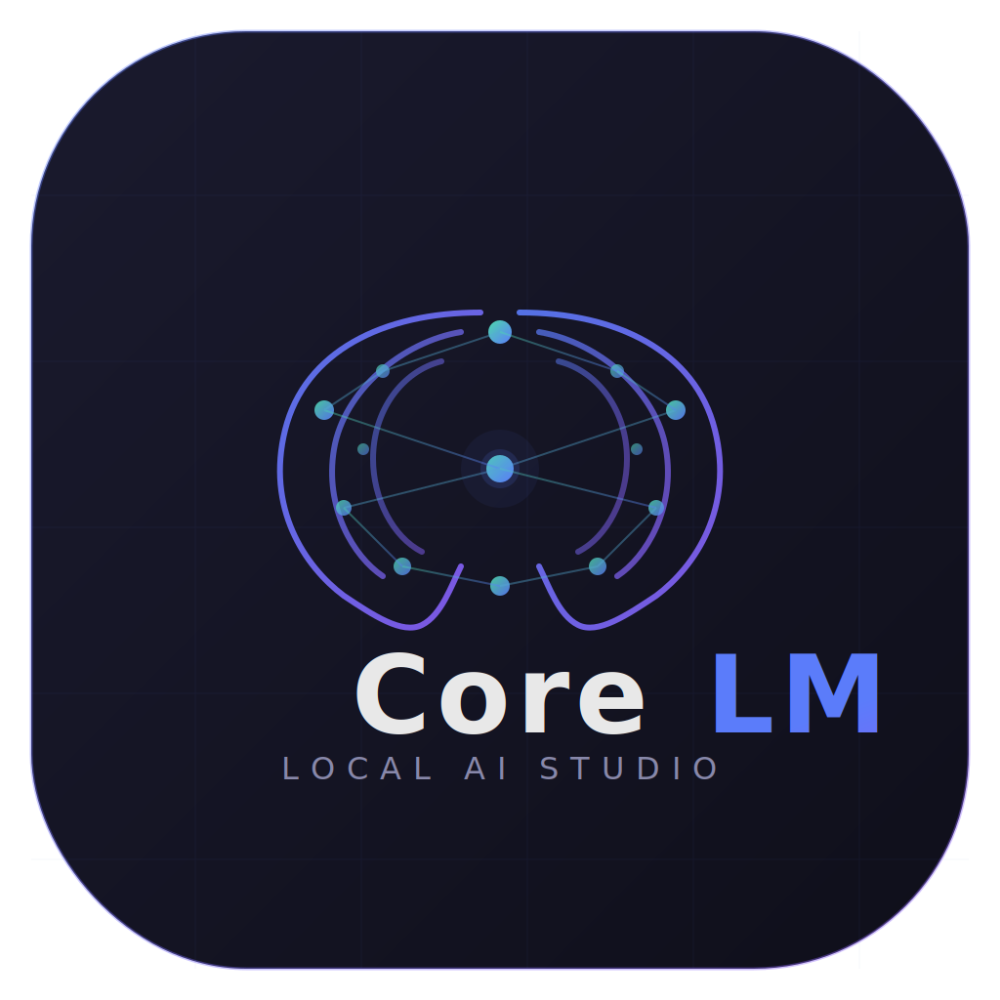
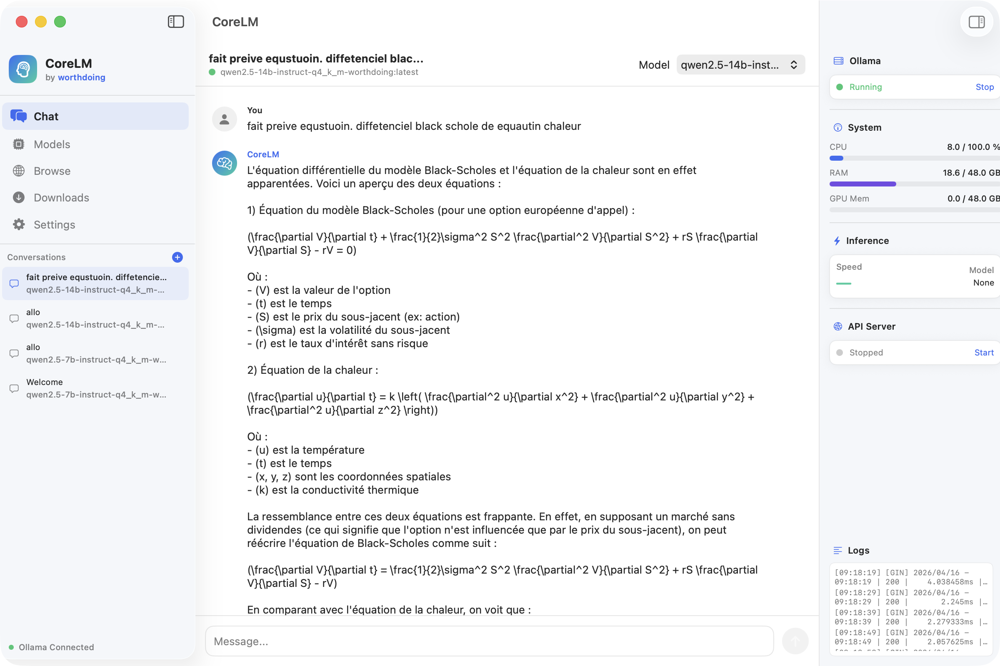
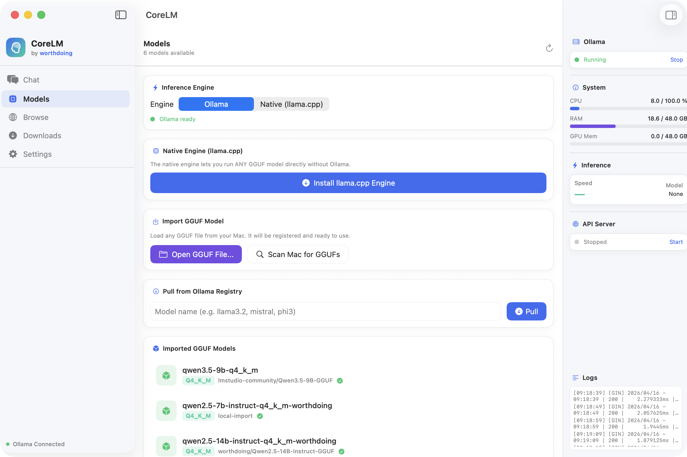
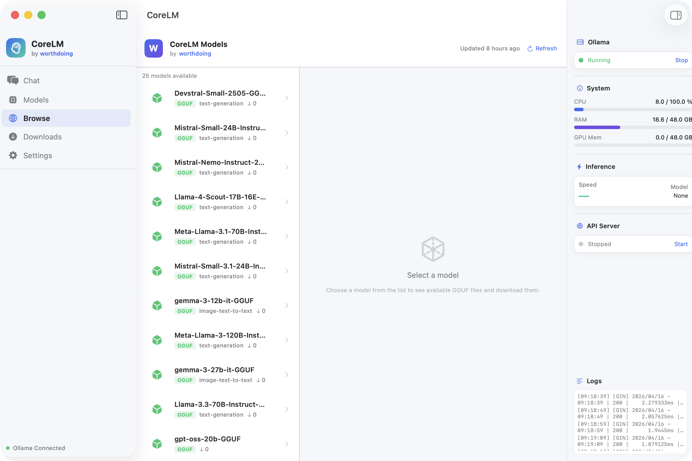
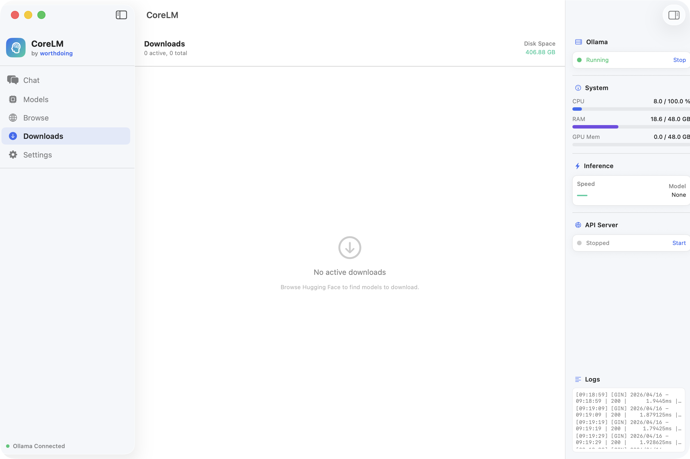
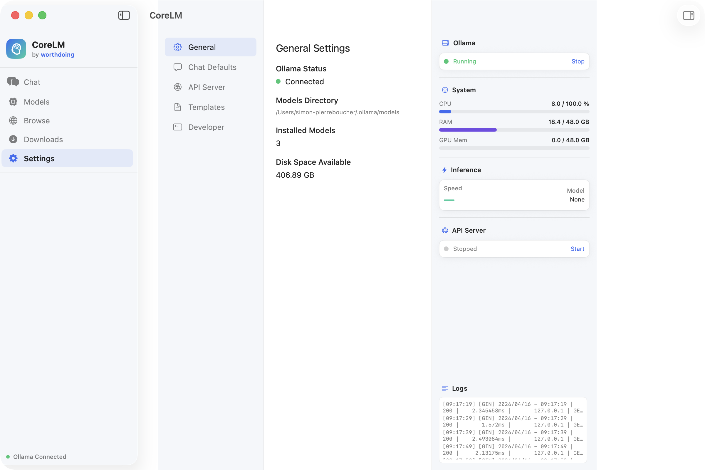

<p align="center">
  
</p>

<h1 align="center">CoreLM</h1>
<p align="center"><strong>Local AI, Perfected.</strong></p>

<p align="center">
  A fully native macOS application for running large language models locally.<br>
  Built entirely in Swift and SwiftUI — no Electron, no WebViews, no cloud dependency.
</p>

<p align="center">
  <a href="https://github.com/worth-doing/CoreLM/releases/latest"><strong>Download Latest Release</strong></a>
  &nbsp;&bull;&nbsp;
  <a href="https://huggingface.co/worthdoing">Models by worthdoing</a>
  &nbsp;&bull;&nbsp;
  <a href="https://worthdoing.ai">worthdoing.ai</a>
</p>

<p align="center">
  
  
  
  
  
</p>

---

## Screenshots

### Chat Interface
> Streaming chat with markdown rendering, multi-turn conversations, and real-time system monitoring.

<p align="center">
  
</p>

### Model Manager
> Dual inference engine (Ollama / llama.cpp), GGUF import, and local model management.

<p align="center">
  
</p>

### Model Browser
> Browse and download GGUF models directly from the worthdoing Hugging Face catalog.

<p align="center">
  
</p>

### Downloads
> Multi-file download manager with real-time progress tracking and disk space monitoring.

<p align="center">
  
</p>

### Settings
> General settings, Ollama status, installed models count, and system configuration.

<p align="center">
  
</p>

---

## What is CoreLM?

CoreLM is a **next-generation local AI studio for macOS**, designed to provide a zero-friction experience for running large language models directly on your Mac. It is the desktop client for models published by [**worthdoing**](https://huggingface.co/worthdoing) on Hugging Face.

Unlike browser-based tools or Electron wrappers, CoreLM is a **100% native macOS application** that leverages Apple Silicon's unified memory architecture and Metal GPU acceleration for maximum inference performance.

### Key Highlights

- **One-click model download** — Browse and download GGUF models from the worthdoing Hugging Face organization
- **Instant inference** — Chat with models immediately after download via Ollama or the native llama.cpp engine
- **Dual engine architecture** — Switch between Ollama and a built-in llama.cpp server for maximum compatibility
- **OpenAI-compatible API** — Local API server that works with any tool expecting the OpenAI format
- **Real-time monitoring** — CPU, RAM, GPU usage and tokens/second displayed live
- **Fully offline** — After initial setup, everything runs locally with zero cloud dependency
- **Signed & notarized** — Distributed as a properly signed and Apple-notarized DMG

---

## Download & Install

### System Requirements

| Requirement | Minimum |
|---|---|
| macOS | 14.0 (Sonoma) or later |
| Chip | Apple Silicon (M1/M2/M3/M4) or Intel |
| RAM | 8 GB (16 GB+ recommended for larger models) |
| Disk | 2 GB free + space for models |

### Installation

1. **Download** the latest `CoreLM-x.x.x.dmg` from [GitHub Releases](https://github.com/worth-doing/CoreLM/releases/latest)
2. **Open** the DMG and drag CoreLM to your Applications folder
3. **Launch** CoreLM — it will auto-detect or help you install Ollama
4. **Browse** the worthdoing model catalog and download a model
5. **Chat** — you're ready to go

> The app is signed with a Developer ID certificate and notarized by Apple. No Gatekeeper warnings.

---

## Architecture

CoreLM is built on a clean 5-layer architecture:

```
+--------------------------------------------------+
|  UI Layer (SwiftUI)                               |
|  Chat | Browse | Models | Downloads | Settings    |
+--------------------------------------------------+
|  Core Engine Layer                                |
|  Ollama Wrapper | Native Engine | GGUF Importer   |
+--------------------------------------------------+
|  Model System Layer                               |
|  HuggingFace API | Format Detection | Registry    |
+--------------------------------------------------+
|  Data Layer                                       |
|  SQLite Persistence | Conversations | Templates   |
+--------------------------------------------------+
|  API Layer                                        |
|  OpenAI-compatible HTTP Server (localhost)         |
+--------------------------------------------------+
```

### Source Code Structure

```
Sources/CoreLM/
├── CoreLM.swift                          # App entry point (@main)
├── App/
│   └── AppState.swift                    # Central state management
├── Core/
│   ├── Engine/
│   │   ├── GGUFImporter.swift            # Auto-import GGUF → Ollama via Modelfile
│   │   └── NativeEngine.swift            # llama.cpp server wrapper
│   └── Ollama/
│       └── OllamaService.swift           # Full Ollama lifecycle management
├── Models/
│   └── AppModels.swift                   # All data models & codable types
├── Services/
│   ├── API/
│   │   └── LocalAPIServer.swift          # OpenAI-compatible local server
│   ├── Download/
│   │   └── DownloadService.swift         # Multi-threaded download manager
│   ├── HuggingFace/
│   │   └── HuggingFaceService.swift      # worthdoing org model fetcher
│   └── PersistenceService.swift          # SQLite storage
├── UI/
│   ├── Chat/
│   │   └── ChatView.swift                # Streaming chat with markdown
│   ├── Components/
│   │   └── DesignSystem.swift            # Theme, colors, reusable components
│   ├── ContentView.swift                 # Main 3-panel layout
│   ├── Downloads/
│   │   └── DownloadsView.swift           # Download progress manager
│   ├── Models/
│   │   ├── HuggingFaceView.swift         # worthdoing model browser
│   │   └── ModelsView.swift              # Local model management
│   ├── Monitor/
│   │   └── MonitorView.swift             # System resource monitor
│   └── Settings/
│       └── SettingsView.swift            # App configuration
└── Utils/
    └── SystemMonitor.swift               # CPU/RAM/GPU metrics
```

---

## Features

### Model Browser

CoreLM connects directly to the [worthdoing Hugging Face organization](https://huggingface.co/worthdoing) to display all available models. The catalog updates dynamically — when a new model is published on Hugging Face, it appears in CoreLM automatically on refresh.

Each GGUF file displays:
- **Quantization type** (Q4_K_M, Q5_K_M, Q8_0, etc.)
- **Quality rating** (color-coded: Excellent → Tiny)
- **Model size tier** (7B, 13B, 70B, etc.)
- **Compatibility badge** for Ollama

One-click download with real-time progress tracking.

### Dual Inference Engine

CoreLM supports two inference backends:

| Feature | Ollama | Native (llama.cpp) |
|---|---|---|
| Setup | Auto-detected / auto-installed | One-click install from app |
| Model format | Ollama registry + imported GGUF | Any GGUF file |
| GPU acceleration | Yes (Metal) | Yes (Metal) |
| Streaming | Yes | Yes |
| Best for | Ease of use | Running any GGUF directly |

Switch between engines at any time from the Models tab.

### Chat Interface

- **Streaming token generation** with real-time display
- **Markdown rendering** with inline formatting
- **Syntax-highlighted code blocks** with one-click copy
- **Multi-turn conversations** with full history
- **Editable system prompts** per conversation
- **Adjustable parameters** — temperature, top-p, top-k, context length, repeat penalty
- **Model switching** mid-conversation
- **Template token cleanup** — raw tokens like `<|im_start|>` are automatically stripped

### GGUF Import System

Import any GGUF file from anywhere on your Mac:
- **File picker** — Open any `.gguf` file
- **Auto-scan** — Scans Downloads, Documents, and LM Studio cache
- **Auto-register** — Creates an Ollama Modelfile with the correct chat template (Gemma, Llama 3, ChatML, Mistral, Phi) and stop tokens
- **Direct run** — Load any GGUF instantly via the native engine

### Download Manager

- **Multi-file downloads** with real-time progress bars
- **Pause / Resume** support
- **Disk space monitoring**
- **Auto-import** — One-click import to CoreLM after download completes

### Local API Server

Built-in OpenAI-compatible HTTP server for external integrations:

```
POST /v1/chat/completions    # Chat completions
GET  /v1/models              # List available models
GET  /health                 # Health check
```

Works with any tool that supports the OpenAI API format:

```python
from openai import OpenAI

client = OpenAI(
    base_url="http://localhost:8080/v1",
    api_key="not-needed"
)

response = client.chat.completions.create(
    model="worthdoing/Qwen2.5-7B-Instruct-GGUF",
    messages=[{"role": "user", "content": "Hello!"}]
)
print(response.choices[0].message.content)
```

```bash
curl http://localhost:8080/v1/chat/completions \
  -H "Content-Type: application/json" \
  -d '{
    "model": "worthdoing/Qwen2.5-7B-Instruct-GGUF",
    "messages": [{"role": "user", "content": "Hello!"}]
  }'
```

### System Monitor

Real-time resource tracking displayed in the right panel:
- **CPU usage** (%)
- **RAM usage** (GB used / total)
- **GPU memory** (estimated from Ollama process)
- **Inference speed** (tokens/second)
- **Ollama status** with start/stop controls
- **API server status** with request counter
- **Live log stream**

### Persistence

All data is stored locally in SQLite:
- **Conversation history** — full message history with auto-save
- **Prompt templates** — save and reuse system prompts + parameter presets
- **User settings** — preferences persisted across sessions
- **Session restore** — conversations are restored on app launch

### Prompt Templates

Save reusable prompt configurations:
- Custom system prompts
- Parameter presets (temperature, top-p, context length)
- One-click apply to current conversation

---

## Building from Source

CoreLM is built entirely with Swift Package Manager — no Xcode project required.

### Prerequisites

- macOS 14.0+
- Swift 5.9+ (included with Xcode Command Line Tools)
- [Ollama](https://ollama.com) (optional, auto-installed by the app)

### Quick Build

```bash
git clone https://github.com/worth-doing/CoreLM.git
cd CoreLM
swift build -c release
```

### Run Development Build

```bash
swift build && .build/debug/CoreLM
```

### Build Signed .app Bundle + DMG

The included `build.sh` script handles the full pipeline:

```bash
./build.sh
```

This will:
1. Compile a release build
2. Create a `.app` bundle with icon
3. Code sign with Developer ID
4. Create a compressed DMG
5. Submit for Apple notarization
6. Staple the notarization ticket

> **Note:** Code signing and notarization require a valid Apple Developer ID certificate. Update the signing identity in `build.sh` for your own builds.

### Dependencies

| Dependency | Purpose | Version |
|---|---|---|
| [SQLite.swift](https://github.com/stephencelis/SQLite.swift) | Local database for conversations, templates, settings | 0.15+ |

No other external dependencies. The app uses only Apple frameworks: SwiftUI, Foundation, Network, Darwin.

---

## Configuration

### Ollama Installation

CoreLM can install Ollama automatically via two methods:
- **Homebrew** — `brew install ollama` (recommended)
- **Direct Download** — Downloads from ollama.com and installs to `/Applications`

### Data Locations

| Data | Path |
|---|---|
| Database | `~/Library/Application Support/CoreLM/coreLM.sqlite3` |
| Downloaded models | `~/Library/Application Support/CoreLM/Downloads/` |
| Imported GGUFs | `~/Library/Application Support/CoreLM/Models/` |
| Generated Modelfiles | `~/Library/Application Support/CoreLM/Modelfiles/` |
| Native engine | `~/Library/Application Support/CoreLM/Engine/` |

### API Server

The local API server runs on `localhost:8080` by default. The port is configurable in Settings. CORS headers are included for browser-based integrations.

---

## Models by worthdoing

CoreLM is the official desktop client for models published by the [worthdoing](https://huggingface.co/worthdoing) organization on Hugging Face. All models are:

- **GGUF format** — optimized for local inference
- **Multiple quantizations** — Q4_K_M, Q5_K_M, Q8_0 variants for different RAM/quality tradeoffs
- **Apple Silicon optimized** — tagged for Mac and local inference
- **Ready to use** — download and chat immediately

Visit [huggingface.co/worthdoing](https://huggingface.co/worthdoing) to see all available models.

---

## Technical Details

### Chat Template Detection

When importing GGUF files, CoreLM automatically detects the correct chat template based on the model name:

| Model Family | Template Format | Stop Tokens |
|---|---|---|
| Gemma | `<start_of_turn>` / `<end_of_turn>` | `<start_of_turn>`, `<end_of_turn>` |
| Llama 3 | `<\|start_header_id\|>` / `<\|eot_id\|>` | `<\|start_header_id\|>`, `<\|eot_id\|>` |
| Qwen / ChatML | `<\|im_start\|>` / `<\|im_end\|>` | `<\|im_start\|>`, `<\|im_end\|>` |
| Mistral | `[INST]` / `[/INST]` | `[INST]`, `[/INST]` |
| Phi | `<\|user\|>` / `<\|end\|>` | `<\|end\|>`, `<\|user\|>` |

Raw template tokens are also stripped from responses in real-time during streaming.

### Apple Silicon Optimization

- Metal GPU acceleration via Ollama and llama.cpp
- Unified memory architecture — GPU shares system RAM
- Multi-threaded inference using all available performance cores
- Native ARM64 binary — no Rosetta translation

### Security

- **Signed** with Developer ID Application certificate
- **Notarized** by Apple — passes Gatekeeper on first launch
- **No telemetry** — zero data sent anywhere
- **Fully offline** — after initial model download, no network required
- **No sandbox** — required for Ollama process management and local server

---

## Contributing

Contributions are welcome. Please open an issue first to discuss what you would like to change.

### Development Setup

```bash
git clone https://github.com/worth-doing/CoreLM.git
cd CoreLM
swift build
```

The project uses no Xcode project files — everything is managed via `Package.swift`.

---

## License

MIT License. See [LICENSE](LICENSE) for details.

---

<p align="center">
  <strong>CoreLM — Local AI, Perfected.</strong><br>
  <sub>Built with care by <a href="https://worthdoing.ai">worthdoing</a></sub>
</p>
